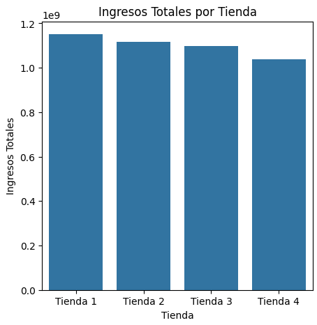

# 📊 Análisis de Datos de 4 Tiendas

Este proyecto presenta un análisis detallado de los datos de **cuatro tiendas** con el fin de evaluar su rendimiento en áreas clave como ventas, categorías, calificaciones y logística. Se incluyen visualizaciones con gráficos de barras y de pastel para facilitar la interpretación.

---

## 📁 1. Importación de Datos

Se cargan y procesan los datos de ventas y productos de cada tienda. Se consolidan para permitir análisis comparativos. Las variables clave incluyen:

- Ingresos
- Categorías de productos
- Calificaciones
- Costos de envío

---

## 💰 2. Análisis de Facturación

Se calcula el ingreso total por tienda y se representa mediante un **gráfico de barras**:

- Se visualiza cuál tienda genera más ingresos.
- Se identifican posibles oportunidades de mejora en las tiendas con menor facturación.

  

📉 **Gráfico:** Analisis ingresos totales de cada tienda (`barplot` con Seaborn)

---

## 🛍️ 3. Ventas por Categoría

Se analiza qué categorías de productos tienen más ventas por tienda:

- Se utiliza `value_counts()` para agrupar y contar.
- Ideal para decisiones de stock o promociones.

 
 
📊 **Grafico:** Gráfico pastel para distribución de categorías (`barplot` con Seaborn)

---

## ⭐ 4. Calificación Promedio de la Tienda

Se calcula el promedio de calificaciones dadas por los clientes a los productos de cada tienda:

- Muestra cómo perciben los clientes la calidad.
- Tiendas con baja calificación podrían necesitar mejoras en servicio o productos.

---

## 🏆 5. Productos Más y Menos Vendidos

Se identifican los productos con mayor y menor volumen de ventas en cada tienda:

- Se muestran rankings o listas ordenadas.
- Esta información es clave para ajustes en inventario.

---

## 🚚 6. Envío Promedio por Tienda

Se evalúan los costos promedio de envío por tienda, visualizados en un **gráfico de pastel**:

- Útil para entender el impacto logístico.
- Tiendas con altos costos pueden optimizar sus métodos de entrega.

 

📈 **Gráfico:** Costo Promedio de Envío por Tienda (`plt.pie()`)

---

## 🔍 Conclusiones

El análisis permite comparar y tomar decisiones estratégicas como:

- Optimización de envíos
- Potenciar categorías más rentables
- Mejora del servicio al cliente en tiendas con menor calificación

---

## 📎 Requisitos Técnicos

- Python
- Pandas
- Seaborn
- Matplotlib

---
